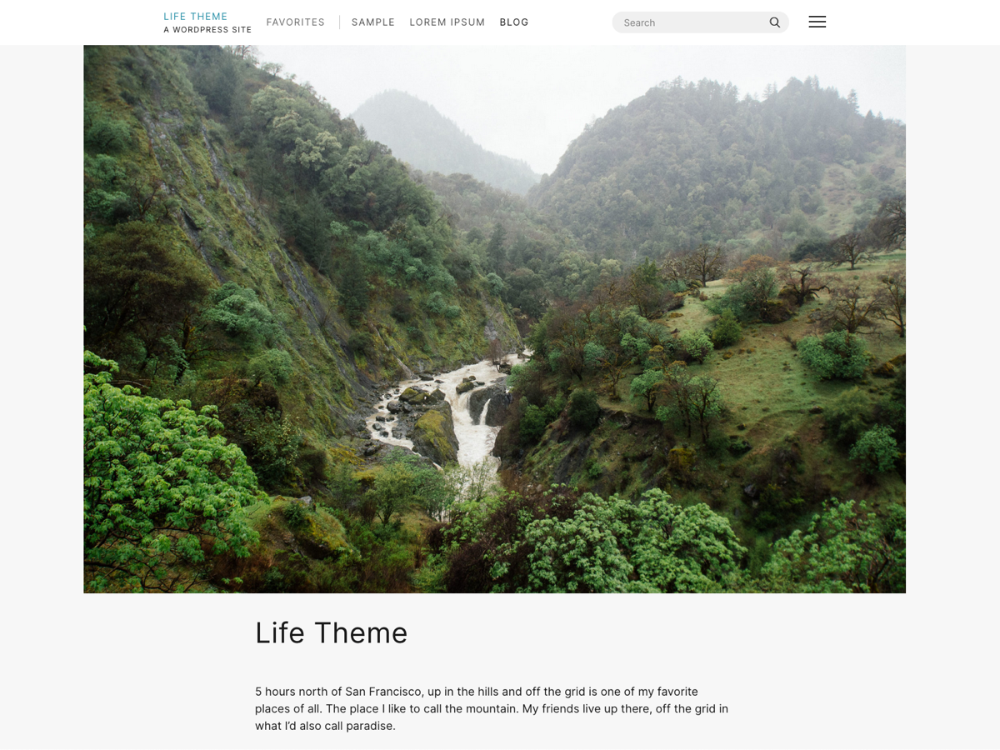

Life Theme
===

Minimalist WordPress theme by Kay Belardinelli.

Theme Installation
------------

*   download the [zip file here](https://chrisglass.com/wp-content/uploads/2021/05/lifetheme.zip)
*   in the WP admin, go to Appearance > Themes > Add New, then click “Upload Theme”; upload the zip file
*   click “activate”

Setting Up Homepage & Posts Page
--------------------------------

*   create a page for homepage, put whatever you want in it
*   create a page for posts/blog, put nothing in it
*   Settings > Reading, under “Your homepage displays” select “A static page”, then set “Homepage” and “Posts page” to the corresponding pages you just made.

Widget Areas
------------

### Headers (Posts, Projects, Characters, Links, Pins, Favorites)

These allow you to customize what appears in the header of the different sections of the website. Add a “Text” widget, and the title will appear as the page heading, along with a paragraph of text in the content of the widget (optional).

### Homepage Secondary Content Area

Add any content here that you wish, and each widget will appear side-by-side on larger screens. It is suggested to use this area as a mini “About” section, with an image of the website owner next to a Text widget with a paragraph or two.

Theme Options
-------------

Appearance > Customize

### Site Identity

*   Site Title: appears in the site header, and browser tab/bookmark
*   Tagline: appears in the browser tab/bookmark of homepage, and (optional) in the site header
*   Subfooter: add copyright, privacy, and other info here
*   Display Site Title and Tagline: this toggles the Tagline in the site header
*   Site Icon: add a custom icon to appear in your browser tab/bookmarks

### Colors

*   Link Color: Select any color for text links throughout the site; Default is black.
*   Header Text Color: This is a deprecated option that is appearing here as a bug. Please ignore.

Post Types
----------

*   Posts: the default WordPress post type (generally used as a blog)
*   Projects: use this as a portfolio or to display your finished projects, etc.
*   Favorites: show off all your favorite things <3
*   Links: link to external websites to share with your readers

Menus
-----

### Locations

*   Primary: Drawer/”Hamburger” navigation. Allows up to two levels of depth.
*   Secondary: Horizontal, desktop only (optional)
*   Footer (optional)
*   Projects Submenu (optional): Add links to your Collections here. Works as a filter.
*   Links Submenu (optional): Add links to your Link Types here. Works as a filter.
*   Favorites Submenu (optional): Add links to your Favorite Types here. Works as a filter.

### Adding Website Sections

*   Go to Appearance > Menus
*   In the “Screen Options” tab in the upper right of the page, make sure the following items are checked: Projects, Characters, Links, Pins, Favorites
*   Projects > View All, then select “All Projects” and add to the menu; Repeat for the remaining post types

Custom Fields
-------------

*   “Currently Listening”: Link to an external song or album.
*   Related Characters / Related Posts: Allows you to link Characters to posts and vice versa. These automatically correlate with each other, creating a recipricol relationship.
*   Sticky Note: Add a little sticky note to any post.

### Installation

*   install Advanced Custom Fields plugin
*   Go to Custom Fields > Tools; import the json file included in the theme folder

WooCommerce
-----------

This theme offers basic support for WooCommerce.

